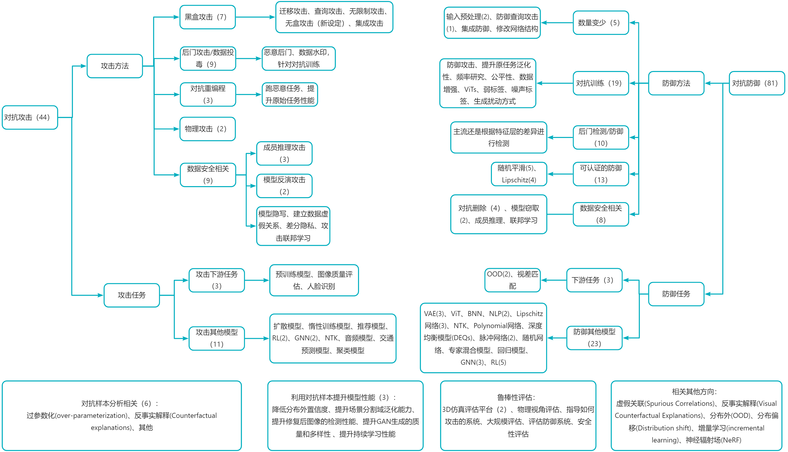

# 对抗攻防论文（NeurIPS2022）

NeurIPS 2022 关于对抗攻防/AI安全相关的论文整理。自认为还是比较全，但重点是偏向对抗攻防，因此用AI进行传统安全分析的论文或许没有在本清单中。

随谈：

1. ***Keywords***和***TL;DR***来源：原作者/审稿评论/论文摘要/个人总结。为了避免翻译错误，以及减少工作量，全部都采用英文。

2. 关于类别，有些文章隶属于多个类别，为了避免重复，按照个人理解归为了某类。

3. 扩展阅读：很多方向都跟对抗攻防具有较高地相关性，如反事实解释（Counterfactual Explanations），虚假关联（Spurious Correlations）。因此适当看些其他领域的论文也很有必要。

4. 物理攻击研究的难点之一是实验成本高昂，但这两年神经辐射场（Newral Radiance Fields, NeRF）用于3D渲染的效果很好，大量研究者在研究。这也给物理攻击的仿真带来了新工具，或许物理世界的攻防研究会变轻松些。

5. NeurIPS上防御的文章接近80篇左右，攻击是40篇左右。可见防御的热度高于攻击，这也是AI安全研究的终极目的，提示AI安全性、可靠性。

6. 对抗攻防以及发展许多年了，最近也出了一些评估系统的研究。学术界、工业界都在尝试搭建一个完善的模型评估、防范系统。部分如下：

    * 腾讯AI实验室、腾讯安全平台部/朱雀实验室、香港中文大学（深圳）、深圳市大数据研究院：[AI安全威胁矩阵 AI SEc Matrix](https://matrix.tencent.com/)
    * 阿里安全、清华大学、RealAI: [ARES-Bench](https://ml.cs.tsinghua.edu.cn/ares-bench/#/leaderboard)
    * 百度安全：[对抗攻击开源工具箱 AdvBox](https://anquan.baidu.com/product/advbox), [AI模型鲁棒性检测](http://shadu.baidu.com/product/robustness), [深度伪造检测](https://anquan.baidu.com/product/deepfake)
    * 北京航空航天大学、商汤、京东探索研究院：[RobustART](http://robust.art/)
    * 普林斯顿大学、图宾根大学、洛桑联邦理工学院：[RobustBench](https://robustbench.github.io/)
    * 清华-知识工程研究室（GNN）：[Graph Robustness Benchmark (GRB)](https://cogdl.ai/grb/home)
    * 微软、伊利诺伊大学-香槟分校（NLP）：[AdvGLUE](https://www.microsoft.com/en-us/research/publication/adversarial-glue-a-multi-task-benchmark-for-robustness-evaluation-of-language-models/)
    * 国立清华大学、IBM：[CARBEN](https://github.com/IBM/composite-adv)
    * ......

> 如有补充、遗漏、错误，欢迎指正！

<!-- omit from toc --> 
# 目录

- [对抗攻防论文（NeurIPS2022）](#对抗攻防论文neurips2022)
- [攻击](#攻击)
  - [黑盒攻击（7）](#黑盒攻击7)
  - [后门攻击/数据投毒(Backdoor, Data Poisoning)（9）](#后门攻击数据投毒backdoor-data-poisoning9)
  - [对抗重编程(Adversarial Reprogramming)(3)](#对抗重编程adversarial-reprogramming3)
  - [物理攻击(Physical Attacks)(2)](#物理攻击physical-attacks2)
  - [隐私相关（对抗攻防）(9)](#隐私相关对抗攻防9)
    - [联邦学习(Federated Learning)](#联邦学习federated-learning)
    - [成员推理攻击(Membership Inference Attacks )](#成员推理攻击membership-inference-attacks-)
    - [模型反演攻击(Model Inversion Attacks)](#模型反演攻击model-inversion-attacks)
    - [模型隐写](#模型隐写)
    - [差分隐私(Differential Privacy)](#差分隐私differential-privacy)
    - [虚假关联(Spurious Correlations)](#虚假关联spurious-correlations)
  - [攻击下游任务](#攻击下游任务)
    - [攻击预训练模型](#攻击预训练模型)
    - [图像质量评估(Image Quality Assessment, IQA)](#图像质量评估image-quality-assessment-iqa)
    - [攻击人脸识别(Face Recognition)](#攻击人脸识别face-recognition)
  - [攻击其他种类模型](#攻击其他种类模型)
    - [扩散模型(Diffusion Models)](#扩散模型diffusion-models)
    - [推荐系统(Recommender Systems)](#推荐系统recommender-systems)
    - [音频攻击](#音频攻击)
    - [图神经网络(Graph Neural Networks, GNN)](#图神经网络graph-neural-networks-gnn)
    - [聚类模型(Clustering)](#聚类模型clustering)
    - [神经正切核(Neural Tangent Kernel, NTK)](#神经正切核neural-tangent-kernel-ntk)
    - [时空交通预测模型(Spatiotemporal Traffic Forecasting Models)](#时空交通预测模型spatiotemporal-traffic-forecasting-models)
    - [强化学习(Reinforcement Learning, RL)](#强化学习reinforcement-learning-rl)
    - [惰性训练模型(Lazy Training)](#惰性训练模型lazy-training)
  - [其他](#其他)
- [防御](#防御)
  - [传统方向](#传统方向)
    - [输入变换防御/破坏对抗扰动](#输入变换防御破坏对抗扰动)
    - [防御查询攻击](#防御查询攻击)
    - [集成防御](#集成防御)
    - [修改网络结构](#修改网络结构)
  - [对抗训练](#对抗训练)
  - [后门检测/防御](#后门检测防御)
  - [certified robustness / provable defenses](#certified-robustness--provable-defenses)
    - [随机平滑(Randomized Smoothing)](#随机平滑randomized-smoothing)
    - [Lipschitz网络 (Lipschitz Neural Networks)](#lipschitz网络-lipschitz-neural-networks)
    - [Others](#others)
  - [数据安全相关](#数据安全相关)
    - [防御模型窃取](#防御模型窃取)
    - [防御成员推理](#防御成员推理)
    - [联邦学习](#联邦学习)
    - [对抗删除](#对抗删除)
  - [下游任务](#下游任务)
    - [分布外数据的检测 (Out-of-Distribution, OOD)](#分布外数据的检测-out-of-distribution-ood)
    - [3D视觉立体匹配、视差匹配(Stereo Matching)](#3d视觉立体匹配视差匹配stereo-matching)
  - [其他模型上的防御](#其他模型上的防御)
    - [VITs](#vits)
    - [VAE](#vae)
    - [二值网络 (Binary Neural Networks, BNN)](#二值网络-binary-neural-networks-bnn)
    - [自然语言模型 (Natural Language Processing, NLP)](#自然语言模型-natural-language-processing-nlp)
    - [深度均衡模型 (Deep Equilibrium Models, DEQs)](#深度均衡模型-deep-equilibrium-models-deqs)
    - [尖峰网络 (Spiking Neural Network)](#尖峰网络-spiking-neural-network)
    - [随机神经网络 (Stochastic Neural Networks)](#随机神经网络-stochastic-neural-networks)
    - [回归 (Regression)](#回归-regression)
    - [神经切线核 (Neural Tangent Kernel, NTK)](#神经切线核-neural-tangent-kernel-ntk)
    - [多项式网络 (Polynomial Neural Networks)](#多项式网络-polynomial-neural-networks)
    - [专家混合模型 (Mixture of Expert models, MoEs)](#专家混合模型-mixture-of-expert-models-moes)
    - [图网络 (Graph Neural Networks, GNN)](#图网络-graph-neural-networks-gnn)
    - [强化学习 (Reinforcement Learning, RL)](#强化学习-reinforcement-learning-rl)
- [分析](#分析)
  - [过参数化](#过参数化)
  - [动态系统角度](#动态系统角度)
  - [反事实解释(Counterfactual Explanations)](#反事实解释counterfactual-explanations)
  - [其他](#其他-1)
- [训练过程中利用对抗样本提高模型准确率](#训练过程中利用对抗样本提高模型准确率)
- [评估](#评估)
  - [3D仿真平台](#3d仿真平台)
  - [鲁棒性评估](#鲁棒性评估)

---

# 攻击

---

## 黑盒攻击（7）

专注黑盒攻击的文章明显变少，并且其中还包括查询攻击，迁移攻击，无盒攻击，颜色攻击，集成攻击。

* **[Natural Color Fool: Towards Boosting Black-box Unrestricted Attacks ](https://openreview.net/forum?id=-T5seeOMnM5)**

Shengming Yuan, Qilong Zhang, Lianli Gao, Yaya Cheng, Jingkuan Song

***Keywords:*** unrestricted color attack, transferability, flexible, natural, semantic-based, unrestricted attack

***TL;DR:*** we propose a Natural Color Fool (NCF), which fully exploits color distributions of semantic classes in an image to craft human-imperceptible, flexible, and highly transferable adversarial examples.

* **[Decision-based Black-box Attack Against Vision Transformers via Patch-wise Adversarial Removal ](https://openreview.net/forum?id=CwQCeJnteii)**

Yucheng Shi, Yahong Han, Yu-an Tan, Xiaohui Kuang

***Keywords:*** Adversarial attack, Black-box attack, Decision-based attack, Vision transformer

***TL;DR:*** This paper proposes a new decision-based black-box adversarial attack against ViTs with theoretical analysis that divides images into patches through a coarse-to-fine search process and compresses the noise on each patch separately.

* **[Boosting the Transferability of Adversarial Attacks with Reverse Adversarial Perturbation ](https://openreview.net/forum?id=k5uFiFLWv3X)**

Zeyu Qin, Yanbo Fan, Yi Liu, Li Shen, Yong Zhang, Jue Wang, Baoyuan Wu

***Keywords:*** Adversarial Transferability, Black-Box Attacks, Adversarial Examples

***TL;DR:*** The authors claim that the adversarial examples should be in a flat local region for better transferability. To boost the transferability, they propose a simple yet effective method named Reverse Adversarial Perturbation (RAP). RAP adds an inner optimization to help the attack escape sharp local minima, which is general to other attacks. Experimental results demonstrate the high effectiveness of RAP.

* **[Blackbox Attacks via Surrogate Ensemble Search ](https://openreview.net/forum?id=lSfrwyww-FR)**

Zikui Cai, Chengyu Song, Srikanth Krishnamurthy, Amit Roy-Chowdhury, M. Salman Asif

***Keywords:*** surrogate ensemble, bilevel optimization, limited query attacks, surrogate ensemble, hard-label attacks, query attack, 

***TL;DR:*** Optimizing a weighted loss function over surrogate ensemble provides highly successful and query efficient blackbox (targeted and untargeted) attacks. In this paper, we propose a novel method for Blackbox Attacks via Surrogate Ensemble Search (BASES) that can generate highly successful blackbox attacks using an extremely small number of queries.

* **[Towards Lightweight Black-Box Attack Against Deep Neural Networks ](https://openreview.net/forum?id=Gpqqm4p91Ez)**

Chenghao Sun, Yonggang Zhang, Wan Chaoqun, Qizhou Wang, Ya Li, Tongliang Liu, Bo Han, Xinmei Tian

***Keywords:*** Adversarial examples, Adversarial attacks, Black-box attack, No-box attack

***TL;DR:*** This paper enables black-box attack to generate powerful adversarial examples even when only one sample per category is available for adversaries.

* **[MORA: Improving Ensemble Robustness Evaluation with Model Reweighing Attack ](https://openreview.net/forum?id=d_m7OKOmPiM)**

Yunrui Yu, Xitong Gao, Cheng-zhong Xu

***Keywords:*** adversarial attack, ensemble adversarial defense, model robustness, model ensemble, ensemble attack

***TL;DR:*** Re-weighing sub-models in various ensemble defenses can lead to attacks with much faster convergence and higher success rates. The main idea is to assign different weights to different models.

* **[GAMA: Generative Adversarial Multi-Object Scene Attacks ](https://openreview.net/forum?id=DRckHIGk8qw)**

Abhishek Aich, Calvin-Khang Ta, Akash A Gupta, Chengyu Song, Srikanth Krishnamurthy, M. Salman Asif, Amit Roy-Chowdhury

***Keywords:*** adversarial machine learning, image classification, generative adversarial attack, Generator-based, multi-label

***TL;DR:*** Vision-language models can be used by attackers to create potent perturbations on multi-object scenes to fool diverse classifiers. 

---

## 后门攻击/数据投毒(Backdoor, Data Poisoning)（9）

后门攻击依旧很多文章进行研究，但内部也细分了很多小小方向了，如在数据上操作，在模型参数上操作。攻击的目的也有破坏分类器性能，保障数据版权/模型版权等

* **[Autoregressive Perturbations for Data Poisoning](https://openreview.net/forum?id=1vusesyN7E)**

Pedro Sandoval-Segura, Vasu Singla, Jonas Geiping, Micah Goldblum, Tom Goldstein, David W. Jacobs

***Keywords:*** autoregressive processes, poisons, data poisoning, data protection, imperceptible perturbations, adversarial machine learning

***TL;DR:*** This paper proposes a new data poisoning attack to prevent data scraping. The proposed method adds class conditional autoregressive (AR) noise to training data to prevent people from using the data for training, and the method is data and model independent, which means that the same noise can be used to poison different datasets and models of different architectures.

* **[Marksman Backdoor: Backdoor Attacks with Arbitrary Target Class ](https://openreview.net/forum?id=i-k6J4VkCDq)**

Khoa D Doan, Yingjie Lao, Ping Li

***Keywords:*** arbitrary trigger, backdoor attacks, generative models

***TL;DR:*** Backdoor Attacks with Arbitrary Target Class

* **[Can Adversarial Training Be Manipulated By Non-Robust Features? ](https://openreview.net/forum?id=TVlKuUk-uj9)**

Lue Tao, Lei Feng, Hongxin Wei, Jinfeng Yi, Sheng-Jun Huang, Songcan Chen

***Keywords:*** Adversarial Training, Adversarial Robustness, Availability Attacks, Hypocritical Perturbations

***TL;DR:*** Adversarial training may fail to provide test robustness under stability attacks, and thus an adaptive defense is necessary to resolve this issue.
This paper introduces a novel data poisoning attack against adversarial training called stability attacks. The goal is to temper the training data such that the robust performance of adversarial training over this manipulated dataset is degraded. To construct this attack, a hypocritical perturbation is built: unlike adversarial perturbations, the aim of hypocritical perturbations is to reinforce the non-robust features in the training data. These perturbations can be generated by negating adversarial example generation objectives.

* **[Sleeper Agent: Scalable Hidden Trigger Backdoors for Neural Networks Trained from Scratch ](https://openreview.net/forum?id=p0LJa6_XHM_)**

Hossein Souri, Liam H Fowl, Rama Chellappa, Micah Goldblum, Tom Goldstein

***Keywords:*** Backdoor attacks, data poisoning, clean labels, adversarial examples, security

***TL;DR:*** We introduce the first scalable hidden trigger backdoor attack to be effective against neural networks trained form scratch.

* **[BadPrompt: Backdoor Attacks on Continuous Prompts ](https://openreview.net/forum?id=rlN6fO3OrP)**

Xiangrui Cai, haidong xu, Sihan Xu, Ying Zhang, Xiaojie Yuan

***Keywords:*** Continuous prompt, backdoor, few-shot learning

***TL;DR:*** This paper conducts a study on the vulnerability of the continuous prompt learning algorithm to backdoor attacks. The authors have made a few interesting observations, such as that the few-shot scenario poses challenge to backdoor attacks. The authors then propose BadPrompt for backdoor attacking continuous prompts. 

* **[Amplifying Membership Exposure via Data Poisoning ](https://openreview.net/forum?id=mT18WLu9J_)**

Yufei Chen, Chao Shen, Yun Shen, Cong Wang, Yang Zhang

***Keywords:*** Data poisoning, membership inference, data privacy

***TL;DR:*** We demonstrate how to use data poisoning attacks to amplify the membership exposure of the targeted class. 

* **[Handcrafted Backdoors in Deep Neural Networks ](https://openreview.net/forum?id=6yuil2_tn9a)**

Sanghyun Hong, Nicholas Carlini, Alexey Kurakin

***Keywords:*** Backdoor attacks, handcrafting model parameters, neural networks, supply-chain attack

***TL;DR:*** We show that the backdoor attacker, originally presented as a supply-chain adversary, can handcraft model parameters to inject backdoors into deep neural networks.

* **[Untargeted Backdoor Watermark: Towards Harmless and Stealthy Dataset Copyright Protection ](https://openreview.net/forum?id=kcQiIrvA_nz)**

Yiming Li, Yang Bai, Yong Jiang, Yong Yang, Shu-Tao Xia, Bo Li

***Keywords:*** Ownership Verification, Dataset Protection, Copyright Protection, Backdoor Attack, AI Security

***TL;DR:*** We explore how to design the untargeted backdoor watermark and how to use it for harmless and stealthy dataset copyright protection.
制作数据水印，从而保护数据版权。

* **[Lethal Dose Conjecture on Data Poisoning ](https://openreview.net/forum?id=PYnSpt3jAz)**

Wenxiao Wang, Alexander Levine, Soheil Feizi

***Keywords:*** data poisoning, robustness, theory, security

***TL;DR:*** We propose Lethal Dose Conjecture, which characterizes the largest amount of poisoned samples any defense can tolerate for a given task, and showcase its implications, including better/easy ways to improve robustness against data poisoning. (This paper suggests a hypothesis for the necessary and sufficient amount of malicious samples needed asymptotically for successful data poisoning. Most notably, the amount is inversely proportional to the minimum amount of data needed to learn the concept for the chose model class. )

---

## 对抗重编程(Adversarial Reprogramming)(3)

传统对抗样本目的是使模型分类错误，对抗重编程则是使模型执行特定任务（该任务可以是有害方面，跑第三方任务，也可以是有利方面，如提升分布外检测性能，提升模型公平性），且该任务可以未被训练过。

* **[Adversarial Reprogramming Revisited ](https://openreview.net/forum?id=F0wPem89q9y)**

Matthias Englert, Ranko Lazic

***Keywords:*** adversarial reprogramming, adversarial examples, adversarial robustness, random networks, implicit bias

***TL;DR:*** We show that neural networks with random weights are susceptible to adversarial reprogramming, and that in some settings training the network can cause its adversarial reprogramming to fail.

* **[Watermarking for Out-of-distribution Detection ](https://openreview.net/forum?id=6rhl2k1SUGs)**

Qizhou Wang, Feng Liu, Yonggang Zhang, Jing Zhang, Chen Gong, Tongliang Liu, Bo Han

***Keywords:*** OOD Detection, model reprogramming, adversarial reprogramming

***TL;DR:*** boosting classification-based OOD detection via model reprogramming

* **[Fairness Reprogramming ](https://openreview.net/forum?id=Nay_rOB-dZv)**

Guanhua Zhang, Yihua Zhang, Yang Zhang, Wenqi Fan, Qing Li, Sijia Liu, Shiyu Chang

***Keywords:*** Fairness, Model Reprogramming, NLP, CV

***TL;DR:*** We introduce a novel model reprogramming based post-processing fairness promoting method for machine learning models.

---

## 物理攻击(Physical Attacks)(2)

物理攻击应该可以借助神经辐射场来更好地模拟物理世界，从而进行实验。

* **[Isometric 3D Adversarial Examples in the Physical World ](https://openreview.net/forum?id=HOG-G4arLnU)**

Yibo Miao, Yinpeng Dong, Jun Zhu, Xiao-Shan Gao

***Keywords:*** 3D adversarial examples, physical attacks, isometry

***TL;DR:*** A novel method to generate nature 3D adversarial examples in the physical world.

* **[Robust Feature-Level Adversaries are Interpretability Tools ](https://openreview.net/forum?id=lQ--doSB2o)**

Stephen Casper, Max Nadeau, Dylan Hadfield-Menell, Gabriel Kreiman

***Keywords:*** Interpretability, Explainability, Adversarial Attacks, Feature-Level 

***TL;DR:*** We produce feature-level adversarial attacks using a deep image generator. They have a wide range of capabilities, and they are effective for studying feature/class (mis)associations in networks.

---

## 隐私相关（对抗攻防）(9)

主要是对抗攻防相关的，因此几乎没有包括联邦学习等隐私相关方向的论文。

### 联邦学习(Federated Learning)

* **[Learning to Attack Federated Learning: A Model-based Reinforcement Learning Attack Framework ](https://openreview.net/forum?id=4OHRr7gmhd4)**

Henger Li, Xiaolin Sun, Zizhan Zheng

***Keywords:*** Federated Learning, Adversarial Attacks, Reinforcement Learning, Data Poisoning Attacks

***TL;DR:*** We propose a model-based reinforcement learning framework to derive untargeted poisoning attacks against federated learning (FL) systems. 

### 成员推理攻击(Membership Inference Attacks )

成员推理攻击是指给定数据记录和模型的黑盒访问权限，判断该记录是否在模型的训练数据集中。

* **[Parameters or Privacy: A Provable Tradeoff Between Overparameterization and Membership Inference ](https://openreview.net/forum?id=7nypt7cjNL)**

Jasper Tan, Blake Mason, Hamid Javadi, Richard Baraniuk

***Keywords:*** Membership inference, Privacy, Linear Regression, Overparameterization

***TL;DR:*** We prove that increasing the number of parameters of a linear model increases its vulnerability to membership inference attacks. 

* **[MExMI: Pool-based Active Model Extraction Crossover Membership Inference ](https://openreview.net/forum?id=o8H6h13Avjy)**

Yaxin Xiao, Qingqing Ye, Haibo Hu, Huadi Zheng, Chengfang Fang, Jie Shi

***Keywords:*** AI Safety, Model Extraction attack, Membership Inference attack

***TL;DR:*** This work explores a chained and iterative reaction where model extraction and membership inference advance each other. (This paper studies the problem of securing a model once it is published as a service. In most prior studies the focus was on either protecting the model from extraction attacks (ME) or from identifying the data used for training the model (MI). The authors propose that a simultaneous attack on both surfaces is even more powerful since the MI attack provides more information to the ME attack.)

* **[M^4I: Multi-modal Models Membership Inference ](https://openreview.net/forum?id=2GsQ8dyfe45)**

Pingyi Hu, Zihan Wang, Ruoxi Sun, Hu Wang, Minhui Xue

***Keywords:*** Membership inference attack, Data privacy leakage, Multimodality

***TL;DR:*** The paper studies the privacy leakage of multi-modal models, proposing a membership inference attack against multi-modal models. Two attack methods are introduced, the metric-based M4I and the feature-based M4I. In metric-based M4I, the adversary can score the data and use a threshold or a binary classifier to distinguish between the scores of member data and non-member data; while in feature-based M4I, a pre-trained shadow multi-modal feature extractor is used to conduct data inference attack.

### 模型反演攻击(Model Inversion Attacks)

模型逆向(反演)攻击(model inversion attack)利用机器学习系统提供的一些API来获取模型的一些初步信息，并通过这些初步信息对模型进行逆向分析，获取模型内部的一些隐私数据。这种攻击和成员推理攻击的区别是，成员推理攻击是针对某一条单一的训练数据，而模型逆向攻击则是倾向于取得某个程度的统计信息。

* **[Measuring Data Reconstruction Defenses in Collaborative Inference Systems ](https://openreview.net/forum?id=UMdY6-r7yRu)**

Mengda Yang, Ziang Li, Juan Wang, Hongxin Hu, Ao Ren, Xiaoyang Xu, Wenzhe Yi

***Keywords:*** model inversion attack, edge-cloud learning 

***TL;DR:*** The paper presents a new model inversion attack for edge-cloud learning which is shown to overcome existing defenses against model inversion in such scenario. The attack is based on Sensitive Feature Distillation (SFD) which simultaneously uses two existing techniques, shadow model and feature-based knowledge distillation. The authors claim that the proposed attack method can effectively extract the purified feature map from the intentionally obfuscated one and recover the private image for popular image datasets such as MNIST, CIFAR10, and CelebA.

* **[Reconstructing Training Data From Trained Neural Networks ](https://openreview.net/forum?id=Sxk8Bse3RKO)**

Niv Haim, Gal Vardi, Gilad Yehudai, michal Irani, Ohad Shamir

***Keywords:*** implicit bias, dataset reconstruction, privacy attacks, model inversion attack

***TL;DR:*** We provide a novel scheme for reconstructing large portions of the actual training samples from a trained neural network. Our scheme is inspired by recent theoretical results of the implicit bias in training neural networks.

### 模型隐写

利用公开的模型权重传输机密文件（如训练集），将数据隐写到模型权重中

* **[House of Cans: Covert Transmission of Internal Datasets via Capacity-Aware Neuron Steganography ](https://openreview.net/forum?id=iAktFMVfeff)**

Xudong Pan, Shengyao Zhang, Mi Zhang, Yifan Yan, Min Yang

***Keywords:*** data stealing, deep learning privacy, AI security

***TL;DR:*** This paper presents a method called Cans for encoding secret datasets into deep neural networks (DNNs) and transmitting them in a openly shared “carrier” DNN. In contrast to existing steganography methods encoding information into least significant bits, the authors encode the secret dataset into a trained publicly shared DNN model such that the public model will predict weights for secret key inputs (known to covert operatives), the weights are used to populate a secret DNN model and the secret DNN model predicts secret dataset for noisy inputs (known to covert operatives). The main advantage of the Cans encoding is that it can covertly transmit over 10000 real-world data samples within a carrier model which has 100× less parameters than the total size of the stolen data, and simultaneously transmit multiple heterogeneous datasets within a single carrier model, under a trivial distortion rate (< 10−5) and with almost no utility loss on the carrier model (< 1%).

### 差分隐私(Differential Privacy)

* **[In Differential Privacy, There is Truth: on Vote-Histogram Leakage in Ensemble Private Learning ](https://openreview.net/forum?id=a3ymtHbL5p5)**

Jiaqi Wang, Roei Schuster, Ilia Shumailov, David Lie, Nicolas Papernot

***Keywords:*** adversarial, differential privacy, privacy, attacks

***TL;DR:*** We show that the differrential privacy mechanism used to protect training sets in ensemble-based decentralized learning, in fact causes leakage of sensitive information.

### 虚假关联(Spurious Correlations)

建立虚假关联，使得数据无法被用于训练，从而保护隐私。有个专门研究虚假关联的方向。

* **[ConfounderGAN: Protecting Image Data Privacy with Causal Confounder ](https://openreview.net/forum?id=XxmOKCt8dO9)**

Qi Tian, Kun Kuang, Kelu Jiang, Furui Liu, Zhihua Wang, Fei Wu

***Keywords:*** data privacy, generative adversarial network, causal confounder

***TL;DR:*** We propose a causality inspired method, named ConfounderGAN, a generative adversarial network (GAN) to make personal image data unlearnable for protecting the data privacy of its owners.

---

## 攻击下游任务

### 攻击预训练模型

* **[Pre-trained Adversarial Perturbations ](https://openreview.net/forum?id=ZLcwSgV-WKH)**

Yuanhao Ban, Yinpeng Dong

***Keywords:*** Adversarial samples, pre-trained models, security

***TL;DR:*** We design a novel algorithm to generate adversarial samples using pre-trained models which can fool the corresponding fine-tuned ones and thus reveal the safety problem of fine-tuning pre-trained models to do downstream tasks.
本文为预先训练的模型开发了一种攻击方法，因此即使对于下游任务，攻击也可以保持有效。

### 图像质量评估(Image Quality Assessment, IQA)

* **[Perceptual Attacks of No-Reference Image Quality Models with Human-in-the-Loop ](https://openreview.net/forum?id=3AV_53iRfTi)**

Weixia Zhang, Dingquan Li, Xiongkuo Min, Guangtao Zhai, Guodong Guo, Xiaokang Yang, Kede Ma

***Keywords:*** Adversarial attack, Image Quality

***TL;DR:*** This paper builds upon work from several fields (adversarial attacks, MAD competition, and Eigen-distortion analysis) which are analysis by synthesis methods used to generate small magnitude perturbations (by some pixel measure) that cause large change in model response (either in classification for adversarial attacks, or perceptual distance in MAD and Eigen-distortion). The paper extends this to the field of no-reference image quality metrics, and compares their contribution with these other methods. They successfully use this method to synthesize images that change the NR-IQA quality score significantly but are below human detection (with humans in the loop).

### 攻击人脸识别(Face Recognition)

* **[Adv-Attribute: Inconspicuous and Transferable Adversarial Attack on Face Recognition ](https://openreview.net/forum?id=d229wqASHOT)**

Shuai Jia, Bangjie Yin, Taiping Yao, Shouhong Ding, Chunhua Shen, Xiaokang Yang, Chao Ma

***Keywords:*** adversarial attack, face recognition, unrestricted attack

***TL;DR:*** This paper studied the inconspicuous and transferable adversarial attacks on face recognition models. Different from previous works that consider  norm perturbations, this paper introduces the framework of adversarial attributes, which generates noise on the attribute space of face images based on StyleGAN. An importance-aware attribute selection approach is proposed to ensure the stealthiness and attacking performance. The experiments on various face models show the effectiveness.

---

## 攻击其他种类模型

### 扩散模型(Diffusion Models)

* **[Diffusion Visual Counterfactual Explanations](https://openreview.net/forum?id=7SEi-ISNni7)**

Maximilian Augustin, Valentyn Boreiko, Francesco Croce, Matthias Hein

***Keywords:*** Diffusion Models, Counterfactual, Visual Counterfactual Explanations

***TL;DR:*** This paper focus on generating Visual Counterfactual Explanations (VCE) for any arbitrary classifier using diffusion models. This work leverages diffusion models to generate realistic and minimal semantically altered VCE examples.

### 推荐系统(Recommender Systems)

* **[Revisiting Injective Attacks on Recommender Systems ](https://openreview.net/forum?id=e5HTq2VA7mu)**

Haoyang LI, Shimin Di, Lei Chen

***Keywords:*** Recommender system, Injective Attacks, Poisoning Attack

***TL;DR:*** We first revisit current injective attackers on recommender systems and then propose a difficulty-aware and diversity-aware attacker.
引流攻击，有点意思

### 音频攻击

* **[VoiceBlock: Privacy through Real-Time Adversarial Attacks with Audio-to-Audio Models ](https://openreview.net/forum?id=8gQEmEgWAkc)**

Patrick O'Reilly, Andreas Bugler, Keshav Bhandari, Max Morrison, Bryan Pardo

***Keywords:*** privacy, adversarial examples, speech, speaker recognition

***TL;DR:*** This paper presents VoiceBox, an adversarial audio attack which (1) dramatically lowers the accuracy of speaker recognition systems, (2) is mostly imperceptible to humans, and (3) can operate in real-time on live audio streams. The authors further demonstrate that their proposed model may also transfer to speaker recognition systems that it was not explicitly trained to fool.

### 图神经网络(Graph Neural Networks, GNN)

* **[Are Defenses for Graph Neural Networks Robust? ](https://openreview.net/forum?id=yCJVkELVT9d)**

Felix Mujkanovic, Simon Geisler, Stephan Günnemann, Aleksandar Bojchevski

***Keywords:*** Adversarial Robustness, Graph Neural Networks, Adaptive Attacks

***TL;DR:*** Adaptive evaluation reveals that most examined adversarial defenses for GNNs show no or only marginal improvement in robustness
The paper suggests that non-adaptive attacks lead to an overstate on adversarial robustness, and thus the authors recommend using adaptive attacks as a gold-standard. 
该论文认为，非自适应攻击会导致对抗性鲁棒性的夸大，因此作者建议使用自适应攻击作为黄金标准。

* **[Certifying Robust Graph Classification under Orthogonal Gromov-Wasserstein Threats ](https://openreview.net/forum?id=qcRgqCXv1o2)**

Hongwei Jin, Zishun Yu, Xinhua Zhang

***Keywords:*** certification of robustness, Gromov-Wasserstein distance, convex relaxation

***TL;DR:*** We develop convex relaxations to certify the robustness of graph convolution networks under Gromov-Wasserstein style threat models.

### 聚类模型(Clustering)

* **[On the Robustness of Deep Clustering Models: Adversarial Attacks and Defenses ](https://openreview.net/forum?id=p62j5eqi_g2)**

Anshuman Chhabra, Ashwin Sekhari, Prasant Mohapatra

***Keywords:*** Deep Clustering, Adversarial Attacks, Visual Learning, Robust Learning

***TL;DR:*** We show that state-of-the-art deep clustering models (even "robust" variants and a production-level MLaaS API) are susceptible to adversarial attacks that significantly reduce performance. Natural defense approaches are unable to mitigate our attack.

### 神经正切核(Neural Tangent Kernel, NTK)

* **[What Can the Neural Tangent Kernel Tell Us About Adversarial Robustness? ](https://openreview.net/forum?id=KBUgVv8z7OA)**

Nikolaos Tsilivis, Julia Kempe

***Keywords:*** Neural Tangent Kernel, Adversarial Examples, Non Robust Features, Linearised Networks

***TL;DR:*** We study adversarial examples though the lens of the NTK, introduce a new set of induced features to uncover the role of robust/non-robust features in classification, and study the kernel dynamics during adversarial training.

### 时空交通预测模型(Spatiotemporal Traffic Forecasting Models)

* **[Practical Adversarial Attacks on Spatiotemporal Traffic Forecasting Models ](https://openreview.net/forum?id=lTKXh991Ayv)**

Fan Liu, Hao Liu, Wenzhao Jiang

***Keywords:*** Spatiotemporal traffic foresting, Adversarial attack

***TL;DR:*** This paper presents a novel adversarial attack for spatiotemporal traffic forecasting models. Moreover, theoretically analysis are conducted to demonstrate the worst performance bound of the attack. Comprehensive experiments on real-world datasets show the effectiveness of the effectiveness of the attack, and how the robustness of the models enhances when combined with the corresponding adversarial training.

### 强化学习(Reinforcement Learning, RL)

* **[Are AlphaZero-like Agents Robust to Adversarial Perturbations? ](https://openreview.net/forum?id=yZ_JlZaOCzv)**

Li-Cheng Lan, Huan Zhang, Ti-Rong Wu, Meng-Yu Tsai, I-Chen Wu, Cho-Jui Hsieh

***Keywords:*** Reinforcement Learning, AlphaGo, AlphaZero, Robustness, adversarial attack, discrete observation space sequential decision making problem

***TL;DR:*** We found adversarial states that will let AlphaZero trained agents make beginner's mistake on the game of Go. 

* **[Robust Imitation via Mirror Descent Inverse Reinforcement Learning ](https://openreview.net/forum?id=huT1G2dtSr)**

Dong-Sig Han, Hyunseo Kim, Hyundo Lee, JeHwan Ryu, Byoung-Tak Zhang

***Keywords:*** inverse reinforcement learning, regularized Markov decision processes, imitation learning, learning theory

***TL;DR:*** we present a novel algorithm that provides rewards as iterative optimization targets for an imitation learning agent. 
(Inverse reinforcement learning (IRL) is an algorithm for learning ground-truth rewards from expert demonstrations where the expert acts optimally with respect to an unknown reward function.)

### 惰性训练模型(Lazy Training)

* **[Adversarial Robustness is at Odds with Lazy Training ](https://openreview.net/forum?id=bt25vx3aW_)**

Yunjuan Wang, Enayat Ullah, Poorya Mianjy, Raman Arora

***Keywords:*** Lazy Training, Adversarial Robustness, 

***TL;DR:*** The paper takes a solid step towards explaining adversarial sensitivity of neural networks based on random networks. The paper shows that networks can be attacked by a single gradient descent step in the lazy regime where parameters are close to initialization.
作者发现惰性训练模型在对抗性攻击中非常脆弱，尽管它在干净的输入上具有良好的泛化性

---

## 其他

* **[Efficient Non-Parametric Optimizer Search for Diverse Tasks ](https://openreview.net/forum?id=oNWqs_JRcDD)**

Ruochen Wang, Yuanhao Xiong, Minhao Cheng, Cho-Jui Hsieh

***Keywords:*** AutoML, Optimizer Search, Optimization, Adversarial Robustness, Graph Neural Networks, BERT

***TL;DR:*** This paper designs a new search space over optimizers and a search algorithm combining rejection sampling with Monte Carlo search. They evaluate the optimizer search on image classification, adversarial attacks, training GNNs, and BERT fine-tuning.
提出一个优化器，测试了一点对抗攻击的实验

---

# 防御

---

## 传统方向

### 输入变换防御/破坏对抗扰动

* **[On the Limitations of Stochastic Pre-processing Defenses ](https://openreview.net/forum?id=P_eBjUlzlV)**

Yue Gao, Ilia Shumailov, Kassem Fawaz, Nicolas Papernot

***Keywords:*** adversarial examples, randomized defenses, preprocessing defenses, input transformation, limitations

***TL;DR:*** We demonstrate the limitations of using stochastic input transformations to provide adversarial robustness.

* **[DISCO: Adversarial Defense with Local Implicit Functions ](https://openreview.net/forum?id=vgIz0emVTAd)**

Chih-Hui Ho, Nuno Vasconcelos

***Keywords:*** Adversarial Defense, Adversarial Attack, Implicit Functions, Local Implicit Function, Denoising

***TL;DR:*** A novel adversarial defense for image classification is proposed with the use of the local implicit functions. (This paper provides a way, named aDversarIal defenSe with local impliCit functiOns (DISCO), to protect classifiers from being attacked by adversarial examples. DISCO is composed of two parts: an encoder and a local implicit module. For inference, DISCO takes an image (either clean or adversarially perturbed) and a query pixel location as input and outputs an RGB value that is as clean as possible. After the process, the new output image is expected to wipe out all the adversarial perturbation on it, making the classifier predicts with high accuracy. In summary, I think that DISCO is one type of denoising model that aims to be adversarially robust.)

### 防御查询攻击

* **[Adversarial Attack on Attackers: Post-Process to Mitigate Black-Box Score-Based Query Attacks ](https://openreview.net/forum?id=7hhH95QKKDX)**

Sizhe Chen, Zhehao Huang, Qinghua Tao, Yingwen Wu, Cihang Xie, Xiaolin Huang

***Keywords:*** adversarial defense, black-box attack, model calibration, score-based query attack

***TL;DR:*** We propose a novel defense against score-based query attacks, which post-processes model outputs to effectively confound attackers without hurting accuracy and calibration.

### 集成防御

* **[Synergy-of-Experts: Collaborate to Improve Adversarial Robustness ](https://openreview.net/forum?id=tuC6teLFZD)**

Sen Cui, Jingfeng Zhang, Jian Liang, Bo Han, Masashi Sugiyama, Changshui Zhang

***Keywords:*** adversarial defense, collaboration, model ensemble.

***TL;DR:*** This paper further improves the ensemble' adversarial robustness through a collaboration scheme.

### 修改网络结构

* **[Random Normalization Aggregation for Adversarial Defense ](https://openreview.net/forum?id=K4W92FUXSF9)**

Minjing Dong, Xinghao Chen, Yunhe Wang, Chang Xu

***Keywords:*** Adversarial Robustness, Adversarial Transferability, Normalization

***TL;DR:*** We introduce a Random Normalization Aggregation module to achieve defense capability via adversarial transferability reduction.

---

## 对抗训练

对抗训练一直是防御的主流之一，从未衰败。

* **[Toward Efficient Robust Training against Union of l_p Threat Models ](https://openreview.net/forum?id=6qdUJblMHqy)**

Gaurang Sriramanan, Maharshi Gor, Soheil Feizi

***Keywords:*** Adversarial Robustness, Adversarial Defense, Adversarial Training, Multiple Threat Models, Fast Adversarial Training, Efficient Adversarial Training, Single-Step Adversarial Training

***TL;DR:*** In this work, we show that by carefully choosing the objective function used for robust training, it is possible to achieve similar, or improved worst-case performance over a union of threat models while utilizing only single-step attacks, thereby achieving a significant reduction in computational resources necessary for training.

* **[Make Some Noise: Reliable and Efficient Single-Step Adversarial Training ](https://openreview.net/forum?id=NENo__bExYu)**

Pau de Jorge, Adel Bibi, Riccardo Volpi, Amartya Sanyal, Philip Torr, Grégory Rogez, Puneet K. Dokania

***Keywords:*** single-step adversarial training, catastrophic overfitting, FGSM, efficient adversarial training, fast adversarial training

***TL;DR:*** We introduce a novel single-step attack for adversarial training that can prevent catastrophic overfitting while obtaining a 3x speed-up.

* **[Explicit Tradeoffs between Adversarial and Natural Distributional Robustness ](https://openreview.net/forum?id=MeYI0QcOIRg)**

Mazda Moayeri, Kiarash Banihashem, Soheil Feizi

***Keywords:*** robustness, adversarial, distributional, spurious correlations

***TL;DR:*** adversarial training can increase model reliance on spurious correlations, reducing distributional robustness

* **[Improving Out-of-Distribution Generalization by Adversarial Training with Structured Priors ](https://openreview.net/forum?id=Ku1afTnmozi)**

Qixun Wang, Yifei Wang, Hong Zhu, Yisen Wang

***Keywords:*** robustness, adversarial training, Out-of-Distribution, 

***TL;DR:*** This paper proposes two modified methods for adversarial training to improve robustness. The noise being added is constrained to low dimensional subspace, and it further changes to more delicate constraints.

* **[Label Noise in Adversarial Training: A Novel Perspective to Study Robust Overfitting ](https://openreview.net/forum?id=9_O9mTLYJQp)**

Chengyu Dong, Liyuan Liu, Jingbo Shang

***Keywords:*** Adversarial training, Label noise, Robust overfitting, Double descent

***TL;DR:*** We show that label noise exists in adversarial training and can explain robust overfitting as well as its intriguing behaviors.

* **[Boosting Barely Robust Learners: A New Perspective on Adversarial Robustness ](https://openreview.net/forum?id=s776AhRFm67)**

Avrim Blum, Omar Montasser, Greg Shakhnarovich, Hongyang Zhang

***Keywords:*** boosting, adversarial robustness, sample complexity, oracle complexity

***TL;DR:*** We present an oracle-efficient algorithm for boosting robustness to adversarial examples. (The paper studies a new direction in adversarial training, on the distinctions between barely robust leaners and strongly robust learners. The paper provides theoretical results on whether we can make a barely robust classifier into a strongly robust classifier. )

* **[Formulating Robustness Against Unforeseen Attacks ](https://openreview.net/forum?id=SGQeKZ126y-)**

Sihui Dai, Saeed Mahloujifar, Prateek Mittal

***Keywords:*** adversarial robustness, training method

***TL;DR:*** This paper studies the model robustness extension to unforeseen perturbations. The main contribution of the paper is a generalization bound for unforeseen threat models with the knowledge of a source model. The paper further provides a training method for achieving better unforeseen robustness using the generalization bound.

* **[Stability Analysis and Generalization Bounds of Adversarial Training ](https://openreview.net/forum?id=78aj7sPX4s-)**

Jiancong Xiao, Yanbo Fan, Ruoyu Sun, Jue Wang, Zhi-Quan Luo

***Keywords:*** Generalization, Adversarial Training, Uniform Stability

***TL;DR:*** This paper uses uniform stability to study generalization in networks under adversarial training. The authors use their framework to understand robust overfitting: the phenomenon in which a network is adversarially robust on the training set, but generalize poorly. The theoretical results in this paper are backed up by experiments and applications to provide theoretical clarity to a number of common methods for reducing overfitting.

* **[Rethinking and Improving Robustness of Convolutional Neural Networks: a Shapley Value-based Approach in Frequency Domain ](https://openreview.net/forum?id=rQ1cNbi07Vq)**

Yiting Chen, Qibing Ren, Junchi Yan

***Keywords:*** Convolutional Neural Network, adversarial robustness, frequency domain, Shapley value

***TL;DR:*** This paper proposes to quantify the impact of frequency components of images on CNNs and investigates adversarial training(AT) and the adversarial attack in the frequency domain.

* **[On the Tradeoff Between Robustness and Fairness ](https://openreview.net/forum?id=LqGA2JMLwBw)**

Xinsong Ma, Zekai Wang, Weiwei Liu

***Keywords:*** Adversarial training, robust fairness

***TL;DR:*** This paper studies an important and interesting topic in adversarial training, i.e., robust fairness issue. The robust fairness issue indicates that the adversarially trained model tends to perform well in some classes and poorly in other classes, creating a disparity in the robust accuracies for different classes. This paper focuses on the influence of perturbation radii on the robust fairness problem and finds that there is a tradeoff between average robust accuracy and robust fairness. To mitigate this tradeoff, the authors present a method to correct the lack of fairness in adversarial training.

* **[Efficient and Effective Augmentation Strategy for Adversarial Training ](https://openreview.net/forum?id=ODkBI1d3phW)**

Sravanti Addepalli, Samyak Jain, Venkatesh Babu Radhakrishnan

***Keywords:*** Adversarial Training, Data Augmentation, Adversarial Robustness

***TL;DR:*** We propose an effective augmentation strategy for Adversarial Training that can be integrated with several Adversarial Training algorithms and data augmentations.

* **[When Adversarial Training Meets Vision Transformers: Recipes from Training to Architecture ](https://openreview.net/forum?id=ZV9WAe-Q0J)**

Yichuan Mo, Dongxian Wu, Yifei Wang, Yiwen Guo, Yisen Wang

***Keywords:*** Vision Transformer, Adversarial Training, Robustness

***TL;DR:*** This paper investigates the training techniques and utilizes the unique architectures to improve the adversarial robustness of Vision transformers.

* **[Enhance the Visual Representation via Discrete Adversarial Training ](https://openreview.net/forum?id=qtZac7A3-F)**

Xiaofeng Mao, YueFeng Chen, Ranjie Duan, Yao Zhu, Gege Qi, Shaokai Ye, Xiaodan Li, Rong Zhang, Hui Xue'

***Keywords:*** Adversarial Training, Discrete Visual Representation, Robustness, Generalization

***TL;DR:*** We propose Discrete Adversarial Training (DAT) which transfers the merit of NLP-style adversarial training to vision models, for improving robustness and generalization simultaneously.

* **[Robust Models are less Over-Confident ](https://openreview.net/forum?id=5K3uopkizS)**

Julia Grabinski, Paul Gavrikov, Janis Keuper, Margret Keuper

***Keywords:*** Computer Vision, Adversarial Robustness, Model Calibration, Adversarial Training

***TL;DR:*** We empirically show that adversarially robust models are less over-confident then their non-robust counterparts.

* **[Adversarial Training with Complementary Labels: On the Benefit of Gradually Informative Attacks ](https://openreview.net/forum?id=s7SukMH7ie9)**

Jianan Zhou, Jianing Zhu, Jingfeng Zhang, Tongliang Liu, Gang Niu, Bo Han, Masashi Sugiyama

***Keywords:*** adversarial training, weakly supervised learning, complementary label

***TL;DR:*** How to equip machine learning models with adversarial robustness when all given labels in a dataset are wrong (i.e., complementary labels)?

* **[Understanding Robust Learning through the Lens of Representation Similarities ](https://openreview.net/forum?id=SbAaNa97bzp)**

Christian Cianfarani, Arjun Nitin Bhagoji, Vikash Sehwag, Ben Zhao, Haitao Zheng, Prateek Mittal

***Keywords:*** representation similarities, robust training, visualizations, adversarial training

***TL;DR:*** Using representation similarities to establish salient differences between robust and non-robust representations. The authors primarily use the CKA metric on CIFAR10 and subsets of ImageNet2012 provide several novel insights on "salient pitfalls" in robust networks which suggest that robust representations are less specialized with a weaker block structure, early layers in robust networks are largely unaffected by adversarial examples as the representations seem similar for benign vs. perturbed inputs, deeper layers overfit during robust learning, and that models trained to be robust to different threat models have similar representations.

* **[Why Do Artificially Generated Data Help Adversarial Robustness ](https://openreview.net/forum?id=W-Z8n9HrWn0)**

Yue Xing, Qifan Song, Guang Cheng
Published: 01 Nov 2022, Last Modified: 07 Oct 2022NeurIPS 2022 AcceptReaders:  EveryoneShow BibtexShow Revisions

***Keywords:*** adversarial robustness, unlabeled data, semi-supervised learning, adversarial training

***TL;DR:*** Our theory in simple models shows the effectiveness of using unlabeled data to help adversarial training. (This paper investigated the phenomena when using simulated data to improve adversarial robustness and provided the theoretical analysis. Specifically, the author decomposed the adversarial risk used in adversarial training to explain why and how unlabeled data can help and how its quality affects the resulting robustness.)

* **[A2: Efficient Automated Attacker for Boosting Adversarial Training ](https://openreview.net/forum?id=SsA-0BZa7B_)**

Zhuoer Xu, Guanghui Zhu, Changhua Meng, shiwen cui, Zhenzhe Ying, Weiqiang Wang, Ming GU, Yihua Huang

***Keywords:*** Adversarial Training, Automated Machine Learning

***TL;DR:*** propose a method called A2 to improve the robustness by constructing the optimal perturbations on-the-fly during training. (Based on the idea of AutoML, this paper proposes an attack method that efficiently generates strong adversarial perturbations. The main idea is to use an attention mechanism to score possible attacks in the attacker space, then sample the attack to perform based on the assigned scores. The experimental results show that the proposed method can increase the attack power and improve the adversarial training performance without too much overhead.)

* **[Phase Transition from Clean Training to Adversarial Training ](https://openreview.net/forum?id=gwsnBjNcVEe)**

Yue Xing, Qifan Song, Guang Cheng

***Keywords:*** Adversarial robustness, Adversarial training

***TL;DR:*** The paper studies how to mitigate the gap between adversarial training and clean training by finding the optimal epsilon. This paper investigates the critical point of the magnitude of the adversarial perturbations with which training trajectories of adversarial training become significantly different from those of standard training.

---

## 后门检测/防御

后门攻击/数据中毒的相关方向也挺火。

* **[Randomized Channel Shuffling: Minimal-Overhead Backdoor Attack Detection without Clean Datasets](https://openreview.net/forum?id=TItRK4VP9X2)**

Ruisi Cai, Zhenyu Zhang, Tianlong Chen, Xiaohan Chen, Zhangyang Wang

***Keywords:*** Backdoor Attack Detection, Randomly Dhuffling

***TL;DR:*** This paper proposes the backdoor defense even without a clean data set. Specifically, after randomly shuffling the filters and comparing the changes in DNN output, the authors find there is an obvious difference between backdoored DNNs and benign DNNs. Futher They propose some metrics to detect whether a given model is backdoored or not. 

* **[On Optimal Learning Under Targeted Data Poisoning ](https://openreview.net/forum?id=6PpLxPPTPd)**

Steve Hanneke, Amin Karbasi, Mohammad Mahmoody, Idan Mehalel, Shay Moran

***Keywords:*** Data Poisoning, the smallest achievable error

***TL;DR:*** The paper information-theoretically studies the possibility and impossibility of learning from poisoned data, in a supervised learning setting with deterministic model predictions, against a relatively powerful attacker who knows the data x on which the model will be tested (or deployed).

* **[Training with More Confidence: Mitigating Injected and Natural Backdoors During Training ](https://openreview.net/forum?id=yNPsd3oG_s)**

Zhenting Wang, Hailun Ding, Juan Zhai, Shiqing Ma

***Keywords:*** Natural Backdoors, Robustness

***TL;DR:*** This paper introduces a new algorithm to mitigate backdoors in neural network models.

* **[Rethinking the Reverse-engineering of Trojan TriggersDownload](https://openreview.net/forum?id=hPfJut2PeLa)**

Zhenting Wang, Kai Mei, Hailun Ding, Juan Zhai, Shiqing Ma

***Keywords:*** Backdoor/Trojan defense

***TL;DR:*** Traditionally, most trojan detection methods focus on reverse-engineering a fixed trojan pattern on the input pictures. This paper proposes to reverse-engineer the trojan in the feature space of DNNs. The proposed method can be used to detect feature-based trojan or dynamic trojan that is input dependent.

* **[Friendly Noise against Adversarial Noise: A Powerful Defense against Data Poisoning Attack ](https://openreview.net/forum?id=DoQElY73YR)**

Tian Yu Liu, Yu Yang, Baharan Mirzasoleiman

***Keywords:*** Data Poisoning, Friendly Noise, different settings

***TL;DR:*** This paper proposes a poisoning defense that unlike existing methods breaks various types of poisoning attacks with a small drop in the generalization. The key claim is that attacks exploit sharp loss regions to craft adversarial perturbations which can substantially alter examples' gradient or representations under small perturbations. The authors then propose to generate noise patterns which maximally perturb examples while minimizing performance degradation.

* **[Pre-activation Distributions Expose Backdoor Neurons ](https://openreview.net/forum?id=wwW-1k1ljIg)**

Runkai Zheng, Rongjun Tang, Jianze Li, Li Liu

***Keywords:*** Backdoor Defense, Backdoor Attack, Adversarial Learning

***TL;DR:*** In this paper, we demonstrate two defense strategies against backdoor attack with the observed property that the backdoor neurons in an infected neural network have a mixture of two distributions with significantly different moments.

* **[BagFlip: A Certified Defense Against Data Poisoning ](https://openreview.net/forum?id=ZidkM5b92G)**

Yuhao Zhang, Aws Albarghouthi, Loris D'Antoni

***Keywords:*** data poisoning, certified defense, backdoor attack, trigger-less attack

***TL;DR:*** We present BagFlip, a model-agnostic certified approach that can effectively defend against both trigger-less and backdoor attack.

* **[One-shot Neural Backdoor Erasing via Adversarial Weight Masking ](https://openreview.net/forum?id=Yb3dRKY170h)**

Shuwen Chai, Jinghui Chen

***Keywords:*** Backdoor Defense, Adverarial Machine Learning, One-shot Learning

***TL;DR:*** The paper presents a method for defending deep neural networks against backdoor attacks, i.e., attacks that inject “triggered” samples into the training set. The method can be seen as an improvement on Adversarial Neuron Pruning (ANP) that uses (i) soft weight masking (SWM), (ii) adversarial trigger recovery (ATR) and (iii) sparsity regularization (SR). The main focus of the paper is in the low-data regime, especially in the one-shot setting and when the network size is small.

* **[Effective Backdoor Defense by Exploiting Sensitivity of Poisoned Samples ](https://openreview.net/forum?id=AsH-Tx2U0Ug)**

Weixin Chen, Baoyuan Wu, Haoqian Wang

***Keywords:*** backdoor defense, backdoor learning, trustworthy AI, AI security

***TL;DR:*** Through the observation that clean and backdoored data with a dissimilar feature representation after data transformation techniques (e.g. rotation, scaling), the author proposed a sensitivity metric, feature consistency towards transformations (FCT), to detect the potential backdoor samples. The author further proposed two backdoor removing modules with inspiration from the existing defenses of semi-supervised learning and backdoor unlearning.

* **[Trap and Replace: Defending Backdoor Attacks by Trapping Them into an Easy-to-Replace Subnetwork ](https://openreview.net/forum?id=h10xdBrOxNI)**

Haotao Wang, Junyuan Hong, Aston Zhang, Jiayu Zhou, Zhangyang Wang

***Keywords:*** backdoor defense, AI security

***TL;DR:*** In this paper, we propose a brand-new backdoor defense strategy, which makes it much easier to remove the harmful influence of backdoor samples from the model. 

---

## certified robustness / provable defenses

鲁棒认证也是防御的主流之一。

### 随机平滑(Randomized Smoothing)

* **[Invariance-Aware Randomized Smoothing Certificates ](https://openreview.net/forum?id=5TfqL2gWdV9)**

Jan Schuchardt, Stephan Günnemann

***Keywords:*** Robustness certification, Verification, Randomized smoothing, Invariances, Equivariances

***TL;DR:*** We derive tight, invariance-aware robustness certificates that augment black-box randomized smoothing with white-box knowledge about model invariances.
首次研究了如何利用模型的不变性来证明其预测的稳健性。

* **[(De-)Randomized Smoothing for Decision Stump Ensembles ](https://openreview.net/forum?id=IbBHnPyjkco)**

Miklós Z. Horváth, Mark Niklas Mueller, Marc Fischer, Martin Vechev

***Keywords:*** adversarial robustness, certified robustness, randomized smoothing, tree-based models

***TL;DR:*** We propose a (De-)Randomized Smoothing approach for decision stump ensembles, which i) significantly improves SOTA certified Lp-norm robustness for tree-based models and ii) enables joint certificates of numerical & categorical perturbations.

* **[General Cutting Planes for Bound-Propagation-Based Neural Network Verification](https://openreview.net/forum?id=5haAJAcofjc)**

Huan Zhang, Shiqi Wang, Kaidi Xu, Linyi Li, Bo Li, Suman Jana, Cho-Jui Hsieh, J Zico Kolter

***Keywords:*** neural network, formal verification, adversarial robustness

***TL;DR:*** We propose GCP-CROWN, which extends bound-propagation-based neural network verifiers with general cutting planes constraints to strengthen the convex relaxations. GCP-CROWN is part of α,β-CROWN (alpha-beta-CROWN), the VNN-COMP 2022 winner.

* **[Smoothed Embeddings for Certified Few-Shot Learning ](https://openreview.net/forum?id=m2JJO3iEe_5)**

Mikhail Pautov, Olesya Kuznetsova, Nurislam Tursynbek, Aleksandr Petiushko, Ivan Oseledets

***Keywords:*** Certified robustness, randomized smoothing, few-shot learning

***TL;DR:*** This paper proposes a certified robustness method for few-shot learning classification based on randomized smoothing.

* **[MultiGuard: Provably Robust Multi-label Classification against Adversarial Examples ](https://openreview.net/forum?id=hcVlMF3Nvxg)**

Jinyuan Jia, Wenjie Qu, Neil Zhenqiang Gong

***Keywords:*** Adversarial examples, multi-label classification, certified defense, randomized smoothing

***TL;DR:*** This paper proposes MultiGuard, where multi-label classification with provable guarantees against adversarial perstubations is studied. The method is based on randomized-smoothing, where randomization with Gaussian noise is utilized to provide a smoothed classifier with provable guarantees, and this work generalizes that to multi-label classification, with adjusted claims to suit multi-label classification.

### Lipschitz网络 (Lipschitz Neural Networks)

* **[Improved techniques for deterministic l2 robustness ](https://openreview.net/forum?id=ftKnhsDquqr)**

Sahil Singla, Soheil Feizi

***Keywords:*** provable defenses, adversarial examples, Lipschitz CNNs, formal guarantees

***TL;DR:*** we introduce several new techniques that lead to significant improvements on CIFAR-10 and CIFAR-100 for both standard and provable robust accuracy and establishes a new state-of-the-art.

* **[LOT: Layer-wise Orthogonal Training on Improving l2 Certified Robustness ](https://openreview.net/forum?id=ZBlaix34YX)**

Xiaojun Xu, Linyi Li, Bo Li

***Keywords:*** Adversarial Robustness, Lipschitz-bounded Models, certified robustness

***TL;DR:*** We propose a 1-Lipschitz CNN which achieves state-of-the-art deterministic certified robustness.

* **[Rethinking Lipschitz Neural Networks and Certified Robustness: A Boolean Function Perspective ](https://openreview.net/forum?id=xaWO6bAY0xM)**

Bohang Zhang, Du Jiang, Di He, Liwei Wang

***Keywords:*** Adversarial Robustness, Certified Defense, Lipschitz Neural Network, Expressive Power

***TL;DR:*** We study certified  robustness from a novel perspective of representing Boolean functions, providing deep insights into how recently proposed Lipschitz networks work and guiding the design of better Lipschitz networks.

* **[Pay attention to your loss : understanding misconceptions about Lipschitz neural networks ](https://openreview.net/forum?id=BRIL0EFvTgc)**

Louis Béthune, Thibaut Boissin, Mathieu Serrurier, Franck Mamalet, Corentin Friedrich, Alberto Gonzalez Sanz

***Keywords:*** robustness, lipschitz, certificate, orthogonal, generalization, loss, provably robust, certified robustness

***TL;DR:*** Lipschitz neural network are good classifiers: they are expressive, they are provably robust, and they generalize. 

### Others

* **[Improving Certified Robustness via Statistical Learning with Logical Reasoning ](https://openreview.net/forum?id=fY6OzqOiTnu)**

Zhuolin Yang, Zhikuan Zhao, Boxin Wang, Jiawei Zhang, Linyi Li, Hengzhi Pei, Bojan Karlaš, Ji Liu, Heng Guo, Ce Zhang, Bo Li

***Keywords:*** certified robustness, logical reasoning, Markov logic networks (MLN)

***TL;DR:*** We propose the sensing-reasoning pipeline with knowledge based logical reasoning and provide the first certified robustness analysis for this pipeline. Results show it outperforms the current state-of-the-art in terms of certified robustness.

* **[Robust Learning against Relational Adversaries ](https://openreview.net/forum?id=WBp4dli3No6)**

Yizhen Wang, Mohannad Alhanahnah, Xiaozhu Meng, Ke Wang, Mihai Christodorescu, Somesh Jha

***Keywords:*** adversarial machine learning, relational adversaries, input normalization, input transformation, defense mechanism with guarantee, malware detection

***TL;DR:*** This paper studies relational adversary, a general threat model in which adversary can manipulate test data via transformations specified by a logical relation. Inspired by the conditions for robustness against relational adversaries and the sources of robustness-accuracy trade-off, the authors propose a learning framework called normalize-and-predict, which leverages input normalization to achieve provable robustness. 

* **[CoPur: Certifiably Robust Collaborative Inference via Feature Purification ](https://openreview.net/forum?id=r5rzV51GZx)**

Jing Liu, Chulin Xie, Oluwasanmi O Koyejo, Bo Li

***Keywords:*** Robust Collaborative Inference, Feature Purification, Adversarial Machine Learning, Vertical Federated Inference, Robust Decomposition

***TL;DR:*** This paper focuses on improving the robustness of the model for collaborative inference. A pre-processing-based defense method is proposed against inference phase attacks. Both theoretical analyses and empirical evaluations are provided to demonstrate the effectiveness of the proposed method.

* **[A Characterization of Semi-Supervised Adversarially Robust PAC Learnability ](https://openreview.net/forum?id=B7Q2mbIFa6Q)**

Idan Attias, Steve Hanneke, Yishay Mansour

***Keywords:*** Semi-Supervised Learning, Adversarial Robustness, PAC Learning, Sample Complexity, Combinatorial Dimensions, Partial Concept Classes

***TL;DR:*** The authors study semi-supervised learning for adversarially robust classification and claim upper bounds on labelled and unlabelled sample complexity of their learner.

---

## 数据安全相关

### 防御模型窃取

* **[Are You Stealing My Model? Sample Correlation for Fingerprinting Deep Neural Networks ](https://openreview.net/forum?id=ebuR5LWzkk0)**

Jiyang Guan, Jian Liang, Ran He

***Keywords:*** NN fingerprinting, model stealing attack, sample correlation

***TL;DR:*** We propose a novel correlation-based fingerprinting method SAC, which robustly detects different kinds of model stealing attacks.

* **[CATER: Intellectual Property Protection on Text Generation APIs via Conditional Watermarks ](https://openreview.net/forum?id=L7P3IvsoUXY)**

Xuanli He, Qiongkai Xu, Yi Zeng, Lingjuan Lyu, Fangzhao Wu, Jiwei Li, Ruoxi Jia

***Keywords:*** natural language generation, conditional lexical watermarks, IP protection

***TL;DR:*** We propose a novel Conditional wATERmarking framework (CATER) for protecting the IP right of text generation APIs caused by imitation attacks.
貌似可以通过API查询到模型的水印，来判断该模型是否是窃取的其他人的模型。

### 防御成员推理

* **[Learning to Generate Inversion-Resistant Model Explanations ](https://openreview.net/forum?id=iy2G-yLGuku)**

Hoyong Jeong, Suyoung Lee, Sung Ju Hwang, Sooel Son

***Keywords:*** model inversion defense, model explanation, explainable AI

***TL;DR:*** We propose the first defense framework that mitigates explanation-aware model inversion attacks by teaching a model to suppress inversion-critical features in a given explanation while preserving its functionality.

### 联邦学习

* **[CalFAT: Calibrated Federated Adversarial Training with Label Skewness ](https://openreview.net/forum?id=8N1NDRGQSQ)**

Chen Chen, Yuchen Liu, Xingjun Ma, Lingjuan Lyu

***Keywords:*** federated learning, adversarial training

***TL;DR:*** A novel calibrated federated adversarial training method that can handle label skewness.

### 对抗删除

从模型中删除掉异常训练数据的影响。可以用来去除敏感属性，去除中毒数据之类的。

* **[Probing Classifiers are Unreliable for Concept Removal and Detection ](https://openreview.net/forum?id=nLGRGuzjtoR)**

Abhinav Kumar, Chenhao Tan, Amit Sharma

***Keywords:*** Probing, Null-Space Removal, Adversarial Removal, Spurious Correlation, Fairness

***TL;DR:*** We theoretically and experimentally demonstrate that even under favorable conditions, probing-based null-space and adversarial removal methods fail to remove the sensitive attribute from latent representation.

* **[Repairing Neural Networks by Leaving the Right Past Behind ](https://openreview.net/forum?id=XiwkvDTU10Y)**

Ryutaro Tanno, Melanie F. Pradier, Aditya Nori, Yingzhen Li

***Keywords:*** model repairment, interpretability, continual learning, data deletion, debugging, interpretability

***TL;DR:*** We develop a framework for repairing machine learning models by identifying detrimental training datapoints and erasing their memories

* **[The Privacy Onion Effect: Memorization is Relative ](https://openreview.net/forum?id=ErUlLrGaVEU)**

Nicholas Carlini, Matthew Jagielski, Chiyuan Zhang, Nicolas Papernot, Andreas Terzis, Florian Tramer

***Keywords:*** memorization, privacy, auditing, membership inference attack

***TL;DR:*** Removing the layer of outlier points that are most vulnerable to a privacy attack exposes a new layer of previously-safe points to the attack
This paper examines the impact of removing records that are most vulnerable to a membership inference attack on the privacy of the remaining records. Given a machine learning model trained on a private dataset, one way to make it more “privacy-preserving” without randomizing the training algorithm could be to identify records at risk, remove them from the dataset, then re-train a model on the remaining records. The paper shows that some of the remaining records become more at risk and investigates potential causes for this phenomenon.

* **[Algorithms that Approximate Data Removal: New Results and Limitations ](https://openreview.net/forum?id=G4VOQPYxBsI)**

Vinith Menon Suriyakumar, Ashia Camage Wilson

***Keywords:*** Online Algorithms, Data Deletion

***TL;DR:*** In this paper we use the infinitesimal jacknife to develop an efficient approximate unlearning algorithm for online delete requests.

---

## 下游任务

### 分布外数据的检测 (Out-of-Distribution, OOD)

* **[Your Out-of-Distribution Detection Method is Not Robust! ](https://openreview.net/forum?id=YUEP3ZmkL1)**

Mohammad Azizmalayeri, Arshia Soltani Moakar, Arman Zarei, Reihaneh Zohrabi, Mohammad Taghi Manzuri, Mohammad Hossein Rohban

***Keywords:*** Out-of-distribution Detection, Adversarial Robustness, Attack

***TL;DR:*** Here we provide benchmarking of current robust OOD detection methods against strong attacks, and propose a novel effective defense.

* **[Provably Adversarially Robust Detection of Out-of-Distribution Data (Almost) for Free ](https://openreview.net/forum?id=9ZWgrozGP0)**

Alexander Meinke, Julian Bitterwolf, Matthias Hein

***Keywords:*** adversarial robustness, out-of-distribution detection

***TL;DR:*** We slightly modify the architecture of neural network classifiers such that one can obtain provable guarantees on adversarially robust OOD detection without any loss in accuracy.

### 3D视觉立体匹配、视差匹配(Stereo Matching)

* **[Revisiting Non-Parametric Matching Cost Volumes for Robust and Generalizable Stereo Matching ](https://openreview.net/forum?id=WXdSp8k0TMn)**

Kelvin Cheng, Tianfu Wu, Zhebin Zhang, Hongyu Sun, Christopher G. Healey

***Keywords:*** Stereo Matching, Contextualized Non-Parametric Cost Volume, Adversarial Robustness, Simulation-to-Real Generalizability

***TL;DR:*** The integration of DNN-contextualized binary-pattern-driven non-parametric cost volume and DNN cost aggregation  leads to more robust and more generalizable stereo matching. 

---

## 其他模型上的防御

### VITs

* **[Understanding and Improving Robustness of Vision Transformers through Patch-based Negative Augmentation ](https://openreview.net/forum?id=U138nQxHh3)**

Yao Qin, Chiyuan Zhang, Ting Chen, Balaji Lakshminarayanan, Alex Beutel, Xuezhi Wang

***Keywords:*** Robustness, Distributional shift, Vision transformers

***TL;DR:*** vision transformers (ViTs) are known to be non-sensitive to patch shuffling, in contrast to humans. Could we make ViTs more robust by making them sensitive to patch shuffling (and other patch-based transformations)? 

### VAE

* **[Alleviating Adversarial Attacks on Variational Autoencoders with MCMC ](https://openreview.net/forum?id=458a8dN8L6)**

Anna Kuzina, Max Welling, Jakub Mikolaj Tomczak

***Keywords:*** VAE, MCMC, Adversarial Attack

***TL;DR:*** We show that MCMC can be used to fix the latent code of the VAE which was corrupted by an adversarial attack. (The paper presents the hypothesis that adversarial attacks on VAEs push the latent code into low probability areas. According to this hypothesis, the attack can be mitigated by pushing back the latent code into more probable region of the latent space. To do so, MCMC is applied in inference time.)

* **[Learning to Drop Out: An Adversarial Approach to Training Sequence VAEs ](https://openreview.net/forum?id=wmdbwZz65FM)**

Đorđe Miladinović, Kumar Shridhar, Kushal Jain, Max B. Paulus, Joachim M. Buhmann, Carl Allen

***Keywords:*** VAE, Dropout, posterior collapse, adversarial training

***TL;DR:*** We propose an adversarial training strategy to achieve information-based stochastic dropout.

* **[Trading off Image Quality for Robustness is not Necessary with Regularized Deterministic Autoencoders ](https://openreview.net/forum?id=9YasTgzma8c)**

Amrutha Saseendran, Kathrin Skubch, Stefan Falkner, Margret Keuper

***Keywords:*** Adversarial robustness, Generative models, Deterministic autoencoder

***TL;DR:*** An adversarially robust deterministic autoencoder with superior performance in terms of both generation and robustness of the learned representations

### 二值网络 (Binary Neural Networks, BNN)

* **[Robust Binary Models by Pruning Randomly-initialized Networks ](https://openreview.net/forum?id=5g-h_DILemH)**

Chen Liu, Ziqi Zhao, Sabine Süsstrunk, Mathieu Salzmann

***Keywords:*** Adversarial Robustness, Model Compression, BNN

***TL;DR:*** We introduce a framework to find robust sub-networks from randomly-initialized binary networks without updating the model parameters.

### 自然语言模型 (Natural Language Processing, NLP)

* **[Adversarial training for high-stakes reliability](https://openreview.net/forum?id=NtJyGXo0nF)**

Daniel Ziegler, Seraphina Nix, Lawrence Chan, Tim Bauman, Peter Schmidt-Nielsen, Tao Lin, Adam Scherlis, Noa Nabeshima, Benjamin Weinstein-Raun, Daniel de Haas, Buck Shlegeris, Nate Thomas

***Keywords:*** adversarial training, language model, redteaming, human adversaries, tool assisted

***TL;DR:*** We used a safe language generation task (``avoid injuries'') as a testbed for achieving high reliability through adversarial training.

* **[Moderate-fitting as a Natural Backdoor Defender for Pre-trained Language Models ](https://openreview.net/forum?id=C7cv9fh8m-b)**

Biru Zhu, Yujia Qin, Ganqu Cui, Yangyi Chen, Weilin Zhao, Chong Fu, Yangdong Deng, Zhiyuan Liu, Jingang Wang, Wei Wu, Maosong Sun, Ming Gu

***Keywords:*** Backdoor Defense, Pre-trained Language Models

***TL;DR:*** In this paper, the authors investigate an interesting phenomenon that when the models are doing a moderate fitting with parameter-efficient training methods, the models are likely to ignore the backdoored features, as those features are ill-trained. Based on this observation, the authors suggest restricting the language model fine-tuning to the moderate-fitting stage to naturally improve the robustness of language models against backdoor triggers. Furthermore, the authors find that (1) parameter capacity, (2) training epochs, and (3) learning rate are key factors that can impact the models’ vulnerability to backdoors. Reducing those hyper-parameters can help models fail to adapt to backdoor features.

### 深度均衡模型 (Deep Equilibrium Models, DEQs)

* **[A Closer Look at the Adversarial Robustness of Deep Equilibrium Models ](https://openreview.net/forum?id=_WHs1ruFKTD)**

Zonghan Yang, Tianyu Pang, Yang Liu

***Keywords:*** Deep Equilibrium Models, Adversarial Attack

***TL;DR:*** This paper evaluated the robustness of the general deep equilibrium model (DEQ) in the traditional white-box attack-defense setting. The authors first pointed out the challenges of training robust DEQs. Then they developed a method to estimate the intermediate gradients of DEQs and integrate them into the adversarial attack pipelines.

### 尖峰网络 (Spiking Neural Network)

* **[Toward Robust Spiking Neural Network Against Adversarial Perturbation ](https://openreview.net/forum?id=Ncyc0JS7Q16)**

Ling Liang, Kaidi Xu, Xing Hu, Lei Deng, Yuan Xie

***Keywords:*** Spiking Neural Network, Certified Training, Adversarial Attack

***TL;DR:*** The first work that applies certification-based techniques to spiking neural networks.

* **[SNN-RAT: Robustness-enhanced Spiking Neural Network through Regularized Adversarial Training ](https://openreview.net/forum?id=xwBdjfKt7_W)**

Jianhao Ding, Tong Bu, Zhaofei Yu, Tiejun Huang, Jian K Liu

***Keywords:*** Spiking Neural Networks, Neural Coding, Perturbation Analysis, Adversarial Training

***TL;DR:*** Experimental and theoretical insights about the robustness of spiking neural networks motivate a robust training scheme.

### 随机神经网络 (Stochastic Neural Networks)

* **[How Sampling Impacts the Robustness of Stochastic Neural Networks ](https://openreview.net/forum?id=-zBN5sBzdvr)**

Sina Däubener, Asja Fischer

***Keywords:*** Stochastic neural network, robustness, adversarial attacks

***TL;DR:*** This paper drives a sufficient condition for the robustness of stochastic neural networks (SNNs).

### 回归 (Regression)

* **[Robust Bayesian Regression via Hard Thresholding ](https://openreview.net/forum?id=krV1UM7Uw1)**

Fan Zheyi, Zhaohui Li, Qingpei Hu

***Keywords:*** Robust regression, Hard thresholding, Bayesian reweighting, Variational inference

***TL;DR:*** By combining the hard thresholding method and prior information, we propose two robust regression algorithms, TRIP and BRHT, which can effectively resist adaptive adversarial attacks.

### 神经切线核 (Neural Tangent Kernel, NTK)

* **[Evolution of Neural Tangent Kernels under Benign and Adversarial Training ](https://openreview.net/forum?id=MVDzIreiRqW)**

Noel Loo, Ramin Hasani, Alexander Amini, Daniela Rus

***Keywords:*** Neural Tangent Kernel, adversarial training

***TL;DR:*** We empirically study the evolution of the NTK under adversarial training.

### 多项式网络 (Polynomial Neural Networks)

* **[Sound and Complete Verification of Polynomial Networks ](https://openreview.net/forum?id=gsdHDI-p6NI)**

Elias Abad Rocamora, Mehmet Fatih Sahin, Fanghui Liu, Grigorios Chrysos, Volkan Cevher

***Keywords:*** branch and bound, adversarial robustness, adversarial examples, certified robustness, polynomial network verification

***TL;DR:*** We propose a branch and bound algorithm for polynomial network verification.

### 专家混合模型 (Mixture of Expert models, MoEs)

* **[On the Adversarial Robustness of Mixture of Experts ](https://openreview.net/forum?id=Fd05J4Bu5Sp)**

Joan Puigcerver, Rodolphe Jenatton, Carlos Riquelme Ruiz, Pranjal Awasthi, Srinadh Bhojanapalli

***Keywords:*** mixture of experts, moe, adversarial, robustness, Lipschitz constants

***TL;DR:*** We analyze conditions under which Mixture of Expert models (MoEs) are more adversarially robust than dense models.

### 图网络 (Graph Neural Networks, GNN)

* **[On the Robustness of Graph Neural Diffusion to Topology Perturbations ](https://openreview.net/forum?id=-8tU21J6BcB)**

Yang Song, QIYU KANG, Sijie Wang, Zhao Kai, Wee Peng Tay

***Keywords:*** GNN, Robustness, Topology perturbation

***TL;DR:*** This paper studies the robustness properties of graph neural partial differential equations and empirically demonstrates that graph neural PDEs are intrinsically more robust against topology perturbation compared to other graph neural networks. 

* **[EvenNet: Ignoring Odd-Hop Neighbors Improves Robustness of Graph Neural Networks ](https://openreview.net/forum?id=SPoiDLr3WE7)**

Runlin Lei, Zhen WANG, Yaliang Li, Bolin Ding, Zhewei Wei

***Keywords:*** Graph Neural Networks, Homophily, Robustness

***TL;DR:*** A spectral GNN without odd-order terms generalizes better across graphs of different homophily. (This paper proposes a simple and effective idea to only use even-order neighbors to improve the robustness and generalization ability of spectral GNNs. It is based on the intuition that a friend's friend is friend, and an enemy's enemy is also friend, thus only using even-order neighbors improves the generalization across different homophily/heterophily levels. )

* **[Randomized Message-Interception Smoothing: Gray-box Certificates for Graph Neural Networks ](https://openreview.net/forum?id=t0VbBTw-o8)**

Yan Scholten, Jan Schuchardt, Simon Geisler, Aleksandar Bojchevski, Stephan Günnemann

***Keywords:*** Robustness Certificates, Adversarial Robustness, Randomized Smoothing, Graph Neural Networks

***TL;DR:*** Exploiting the message-passing principle of Graph Neural Networks to certify robustness against strong adversaries that can arbitrarily perturb all features of multiple nodes in the graph.

### 强化学习 (Reinforcement Learning, RL)

* **[Towards Safe Reinforcement Learning with a Safety Editor Policy ](https://openreview.net/forum?id=U1m_93ansV)**

Haonan Yu, Wei Xu, Haichao Zhang

***Keywords:*** Safe RL, constrained Markov decision process, safety layer, first-order safety method, model-free RL

***TL;DR:*** Learning a safety editor policy that transforms potentially unsafe actions proposed by a utility maximizer policy into safe ones, achieving extremely low constraint violation rates on 14 challenging safe RL tasks.

* **[Enhancing Safe Exploration Using Safety State Augmentation ](https://openreview.net/forum?id=GH4q4WmGAsl)**

Aivar Sootla, Alexander Imani Cowen-Rivers, Jun Wang, Haitham Bou Ammar

***Keywords:*** safe reinforcement learning, safety during training

***TL;DR:*** We aim at improving safe exploration by augmenting safety information into the state-space and by developing ways to control the safety state

* **[Efficient Adversarial Training without Attacking: Worst-Case-Aware Robust Reinforcement Learning ](https://openreview.net/forum?id=y-E1htoQl-n)**

Yongyuan Liang, Yanchao Sun, Ruijie Zheng, Furong Huang

***Keywords:*** Reinforcement Learning, Robustness, Worst-case Aware, Adversarial Learning

***TL;DR:*** We propose a strong and efficient robust training framework for RL, WocaR-RL, that directly estimates and optimizes the worst-case reward of a policy under bounded  attacks without requiring extra samples for learning an attacker. 

* **[RAMBO-RL: Robust Adversarial Model-Based Offline Reinforcement Learning ](https://openreview.net/forum?id=nrksGSRT7kX)**

Marc Rigter, Bruno Lacerda, Nick Hawes

***Keywords:*** offline reinforcement learning, model-based reinforcement learning, deep reinforcement learning, robust reinforcement learning, adversarial learning, Adversarial training

***TL;DR:*** Adversarial training of the dynamics model to prevent model exploitation in model-based offline RL.

* **[Provable Defense against Backdoor Policies in Reinforcement Learning](https://openreview.net/forum?id=11WmFbrIt26)**

Shubham Kumar Bharti, Xuezhou Zhang, Adish Singla, Jerry Zhu

***Keywords:*** Adversarial Learning, Reinforcement Learning, Backdoor defense

***TL;DR:*** We propose a provable defense mechanism against backdoor policies in reinforcement learning.

---

# 分析

## 过参数化

* **[Overparameterization from Computational Constraints ](https://openreview.net/forum?id=7uIGl1AB_M_)**

Sanjam Garg, Somesh Jha, Saeed Mahloujifar, Mohammad Mahmoody, Mingyuan Wang

***Keywords:*** Large models, Robustness, Adversarial examples, Computational hardness, over-parameterization

***TL;DR:*** We show that efficient (robust) learning could provably need more parameters than inefficient (robust) learning.

* **[Why Robust Generalization in Deep Learning is Difficult: Perspective of Expressive Power ](https://openreview.net/forum?id=Z26xiZkbjgE)**

Binghui Li, Jikai Jin, Han Zhong, John E. Hopcroft, Liwei Wang

***Keywords:*** deep learning theory, adversarial robustness, robust generalization gap, expressive power, over-parameterization

***TL;DR:*** We provide a theoretical understanding of robust generalization gap from the perspective of expressive power for deep neural networks. 

* **[Robustness in deep learning: The good (width), the bad (depth), and the ugly (initialization) ](https://openreview.net/forum?id=m8vzptcFKsT)**

Zhenyu Zhu, Fanghui Liu, Grigorios Chrysos, Volkan Cevher

***Keywords:*** over-parameterized model, robustness, perturbation stability, initialization scheme

***TL;DR:*** We explore the interplay of the width, the depth and the initialization(s) on the average robustness of neural networks with new theoretical bounds in an effort to address the apparent contradiction in the literature.  

## 动态系统角度

* **[Defending Against Adversarial Attacks via Neural Dynamic System ](https://openreview.net/forum?id=9BL0-oS7W7_)**

Xiyuan Li, Xin Zou, Weiwei Liu

***Keywords:*** ordinary differential equation (ODE), Adversarial Defense

***TL;DR:*** The paper studies the problem of enhancing neural network robustness from a dynamic system perspective. To this end, the authors proposed a nonautonomous neural ordinary differential equation (ASODE) that makes clean instances be their asymptotically stable equilibrium points. In this way, the asymptotic stability will reduce the adversarial noise to bring the nearby adversarial examples close to the clean instance. The empirical studies show that the proposed method can defend against existing attacks and outperform SOTA defense methods.

## 反事实解释(Counterfactual Explanations)

机器学习可解释性中的一个子领域，反事实解释。该领域的方法主要回答的问题是”如果输入的特征发生了某种特定变化之后，输出的结果将如何变化“。通过回答这个问题，可以解释模型是如何做出决策的。（有很多这方面的论文，这里没有列举）

* **[CLEAR: Generative Counterfactual Explanations on Graphs ](https://openreview.net/forum?id=YR-s5leIvh)**

Jing Ma, Ruocheng Guo, Saumitra Mishra, Aidong Zhang, Jundong Li

***Keywords:*** Counterfactual explanations, graph, explainability

***TL;DR:*** This paper proposes a model-agnostic framework for counterfactual explanations on graphs, facilitating the optimization, generalization, and causality in counterfactual explanation generation.

## 其他

* **[Gradient Methods Provably Converge to Non-Robust Networks ](https://openreview.net/forum?id=XDZhagjfMP)**

Gal Vardi, Gilad Yehudai, Ohad Shamir

***Keywords:*** implicit bias, deep learning theory, robustness, provably non-robust

***TL;DR:*** We show that depth-2 neural networks trained under a natural setting are provably non-robust, even when robust networks on the same dataset exist.
(The paper presents an interesting and novel analysis for an important problem of understanding why standard gradient-based training can lead to non-robust models, although robust models provably exist. The paper nicely points out that margin maximization in the parameter space is not aligned in general with the L2 robustness. Moreover, I think the paper is an interesting contribution towards the discussion of adversarial examples being “bugs vs. features” (https://arxiv.org/abs/1905.02175) where the authors of the current paper give theoretical evidence that adversarial examples can also arise as “bugs” from the particular optimization algorithm we use for training.)
说明标准训练的网络肯定是非鲁棒的。

* **[Sampling without Replacement Leads to Faster Rates in Finite-Sum Minimax Optimization ](https://openreview.net/forum?id=CTqjKUAyRBt)**

Aniket Das, Bernhard Schölkopf, Michael Muehlebach

***Keywords:*** Minimax Optimization, Smooth Games, Nonconvex-Nonconcave Minimax Optimization, Sampling without Replacement, Random Reshuffling, Shuffle Once, Incremental Gradient, Gradient Descent Ascent, Proximal Point Method, Alternating Gradient Descent Ascent

***TL;DR:*** The paper shows the convergence of stochastic GDA with random reshuffling (RR), shuffle once (SO) and adversarial shuffling (AS) for strongly-convex-strongly-concave min-max problems. It also extends to the two-sided PL condition with alternating GDA.

* **[Towards Consistency in Adversarial Classification ](https://openreview.net/forum?id=2_AZxVpFlGP)**

Laurent Meunier, Raphael Ettedgui, Rafael Pinot, Yann Chevaleyre, Jamal Atif

***Keywords:*** adversarial, consistency, calibration

***TL;DR:*** We study calibration and consistency of losses in the adversarial setting.
Rating: 796

* **[Adversarially Robust Learning: A Generic Minimax Optimal Learner and Characterization ](https://openreview.net/forum?id=03Qml_SaPqV)**

Omar Montasser, Steve Hanneke, Nathan Srebro

***Keywords:*** adversarially robust PAC learning, sample complexity, theoretical analysis

***TL;DR:*** We present a minimax optimal learner for the problem of learning predictors robust to adversarial examples at test-time.
Rating: 987

# 训练过程中利用对抗样本提高模型准确率

* **[Adversarial Unlearning: Reducing Confidence Along Adversarial Directions ](https://openreview.net/forum?id=cJ006qBE8Uv)**

Amrith Setlur, Benjamin Eysenbach, Virginia Smith, Sergey Levine

***Keywords:*** supervised learning, overfitting, regularization, adversarial examples, spurious correlations, out-of-distribution

***TL;DR:*** The method, which we call RCAD (Reducing Confidence along Adversarial Directions), aims to reduce confidence on out-of-distribution examples lying along directions adversarially chosen to increase training loss. (Training the model to make unconfident predictions on self-generated examples along the adversarial direction can improve generaiization. )
RCAD（沿对抗方向降低置信度），旨在降低分布外示例的置信度，这些示例位于对抗性选择的方向上，以增加训练损失。与对抗训练相比，RCAD 不会尝试对模型进行鲁棒化以输出原始标签，而是对其进行正则化，以降低使用比传统对抗训练大得多的扰动生成的点的置信度。

* **[Adversarial Style Augmentation for Domain Generalized Urban-Scene Segmentation ](https://openreview.net/forum?id=lXUp6skJ7r)**

Zhun Zhong, Yuyang Zhao, Gim Hee Lee, Nicu Sebe

***Keywords:*** Domain Generalization, Semantic Segmentation, Adversarial Style Augmentation

***TL;DR:*** We propose a novel adversarial style augmentation approach for domain generalization in semantic segmentation, which is easy to implement and can effectively improve the model performance on unseen real domains.
利用对抗样本（对抗风格增强）提升场景分割的域泛化能力

* **[Rethinking Image Restoration for Object Detection ](https://openreview.net/forum?id=se2oxj-6Nz)**

Shangquan Sun, Wenqi Ren, Tao Wang, Xiaochun Cao

***Keywords:*** Image Restoration, Object Detection, Image Dehazing, Low Light Enhancement, Targeted Adversarial Attack

***TL;DR:*** We propose a training pipeline for image restoration model by generating pseudo ground truth with targeted adversarial attack, such that a subsequent detector can predicts better on its recovered image.
图像修复过程中利用对抗攻击提高目标检测性能

* **[Improving Generative Adversarial Networks via Adversarial Learning in Latent Space ](https://openreview.net/forum?id=Magl9CSHB87)**

Yang Li, Yichuan Mo, Liangliang Shi, Junchi Yan

***Keywords:*** Generative Adversarial Networks, Adversarial Learning, Latent Space

***TL;DR:*** This paper proposes to improve the performance of GAN in terms of generative quality and diversity by mining the latent space using adversarial learning (I-FGSM).
提升GAN生成的多样性和质量

* **[Retrospective Adversarial Replay for Continual Learning ](https://openreview.net/forum?id=XEoih0EwCwL)**

Lilly Kumari, Shengjie Wang, Tianyi Zhou, Jeff Bilmes

***Keywords:*** continual learning, adversarial perturbations, class incremental learning, boundary samples, catastrophic forgetting

***TL;DR:*** we develop an adversarial augmentation based method that combines new task samples with memory buffer samples for continual learning, which can be applied with general continual learning methods such as ER, MIR, etc. to achieve improved performance
(The paper proposes a novel approach to tackle the classifier bias problem in the context of continual learning. For this purpose, the approach (called RAR) focusses on the examplars that are close to the the forgetting border. RAR perturbs the selected exemplars towards the closest sample from the current task in the latent space. By replaying such samples, RAR is able to refine the boundary between previous and current tasks, hence combating forgetting and reducing bias towards the current task. Moreover, the authors propose to combine RAR with the mix-up technique which significantly improves continual learning in the small buffer regime. RAR is a generic approach and could be combined with any experience replay method.)
解决持续学习中分类器偏差问题

---

# 评估

## 3D仿真平台
* **[3DB: A Framework for Debugging Computer Vision Models ](https://openreview.net/forum?id=dRgHxaOJsiV)**

Guillaume Leclerc, Hadi Salman, Andrew Ilyas, Sai Vemprala, Logan Engstrom, Vibhav Vineet, Kai Yuanqing Xiao, Pengchuan Zhang, Shibani Santurkar, Greg Yang, Ashish Kapoor, Aleksander Madry

***Keywords:*** robustness, debugging, simulation, computer vision, deep learning

***TL;DR:*** We introduce 3DB: an extendable, unified framework for testing and debugging vision models using photorealistic simulation.
可用作评估计算机视觉任务，物理攻击之类的。

* **[Finding Differences Between Transformers and ConvNets Using Counterfactual Simulation Testing ](https://openreview.net/forum?id=Aisi2oEq1sc)**

Nataniel Ruiz, Sarah Adel Bargal, Cihang Xie, Kate Saenko, Stan Sclaroff

***Keywords:*** convolutional neural networks, vision transformers, robustness, testing, simulation, synthetic data, out of distribution, generalization, domain shift

***TL;DR:*** A framework to compare CNNs and Vision Transformers by answering counterfactual questions using realistic simulated scenes.
本文研究了不同 Imagenet 预训练分类器对对象比例、对象姿势、场景照明和 3D 遮挡变化的鲁棒性。作者为此生成了一个包含272k合成图像（“NVD”）的大型数据集，这是该论文的核心贡献。主要研究的两种架构是ConvNext架构和Swin ViT架构。

## 鲁棒性评估

* **[Indicators of Attack Failure: Debugging and Improving Optimization of Adversarial Examples ](https://openreview.net/forum?id=Y1sWzKW0k4L)**

Maura Pintor, Luca Demetrio, Angelo Sotgiu, Ambra Demontis, Nicholas Carlini, Battista Biggio, Fabio Roli

***Keywords:*** Debugging, machine learning, adversarial machine learning

***TL;DR:*** Analysis of failures in the optimization of adversarial attacks, indicators to reveal when they happen, and systematic framework to avoid them.

* **[On the Safety of Interpretable Machine Learning: A Maximum Deviation Approach ](https://openreview.net/forum?id=WPXRVQaP9Oq)**

Dennis Wei, Rahul Nair, Amit Dhurandhar, Kush R. Varshney, Elizabeth M. Daly, Moninder Singh

***Keywords:*** safety, interpretability, explainability, Evaluations

***TL;DR:*** We assess the safety of a predictive model through its maximum deviation from a reference model and show how interpretability facilitates this safety assessment.

* **[ViewFool: Evaluating the Robustness of Visual Recognition to Adversarial Viewpoints ](https://openreview.net/forum?id=X0m9q0IcsmX)**

Yinpeng Dong, Shouwei Ruan, Hang Su, Caixin Kang, Xingxing Wei, Jun Zhu

***Keywords:*** Visual Recognition, Robustness, Viewpoint Changes, OOD Generalization, Robustness Evaluations, realistic 3D models

***TL;DR:*** A novel method to evaluate viewpoint robustness of visual recognition models in the physical world. (In this work, the authors constrain adversarial perturbations to the space of object and camera pose that lead to poor visual recognition performance. Importantly, the space considered is constrained to be physically plausible. They leverage recent advances in Neural Rendering (NeRF) to generate realistic 3D models of objects, and optimize for non-canonical poses that lead to poor predictive performance. Finally, the authors propose a new benchmark for evaluating viewpoint robustness (ImageNet-V) which may be used to assess the general quality of any image recognition system.)

* **[Assaying Out-Of-Distribution Generalization in Transfer Learning ](https://openreview.net/forum?id=57Ryl7lLD4h)**

Florian Wenzel, Andrea Dittadi, Peter Vincent Gehler, Carl-Johann Simon-Gabriel, Max Horn, Dominik Zietlow, David Kernert, Chris Russell, Thomas Brox, Bernt Schiele, Bernhard Schölkopf, Francesco Locatello

***Keywords:*** Out-of-distribution generalization, robustness, distribution shifts, large-scale empirical study, Robustness Evaluations

***TL;DR:*** We perform a large scale empirical study of out-of-distribution generalization. (This paper presents a large-scale empirical study of deep neural networks’ Out-Of-Distribution (OOD) generalization on visual recognition tasks. The main motivation is that previous studies for OOD generalization consider specific types of distributional shifts and are evaluated with specific datasets and architectures, and thus the conclusion drawn from one setting may not generalize to another. To overcome such limitations, the authors perform large-scale experiments under diverse types of OOD data on 172 ID/OOD datasets with multiple architectures. The experimental results show that some of the conclusions drawn from previous small-scale works do not hold in general and may depend on the target tasks, and that the factor that is consistently correlated with the OOD performance is the model’s ID performance.)

* **[Increasing Confidence in Adversarial Robustness Evaluations ](https://openreview.net/forum?id=NkK4i91VWp)**

Roland S. Zimmermann, Wieland Brendel, Florian Tramer, Nicholas Carlini

***Keywords:*** adversarial robustness, robustness, adversarial attack, Adversarial Robustness Evaluations

***TL;DR:*** We propose a test that enables researchers to find flawed adversarial robustness evaluations. Passing our test produces compelling evidence that the attacks used have sufficient power to evaluate the model’s robustness. (This paper proposes a binarization test to identify weak attacks against adversarial example defenses. The proposed test changes the model’s prediction layer to a binary classifier and fine-tunes it on a small crafted dataset for each benign example. As a result, the original attack, if sufficiently strong, should be able to find adversarial examples when applied to the modified model. This test serves as an active robustness test to complement existing passive tests of weak attacks. )
